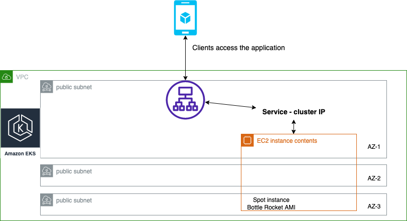

# Terraform EKS Cluster Project Dev-1

## Architecture Overview


## Description
This Terraform project implements an Amazon Elastic Kubernetes Service (EKS) cluster. It creates a Virtual Private Cloud (VPC) with public subnets distributed across multiple Availability Zones (AZs), provisions an EKS cluster, and establishes policies and roles necessary for the Application Load Balancer (ALB) Ingress Controller

## Pre Requirements
* Terraform installed
* AWS account
## Installation

To install terraform on your machine please follow the link:
https://developer.hashicorp.com/terraform/tutorials/aws-get-started/install-cli

To install aws CLI on your machine:
https://docs.aws.amazon.com/cli/latest/userguide/getting-started-install.html

To enable your local machine to communicate with your aws account you can:
1. Create a specific user group and user to manage the eks cluster
2. Utilize your admin account
3. .....

```bash
aws configure
```

## Setup the EKS Cluster
In order to setup the cluster please follow along
1. Create VPC
```bash
terraform apply --auto-approve
```

2. Copy vpc_id to variables in the eks cluster (the vpc_id should appear on your terminal)

3. Create the EKS cluster
```bash
terraform apply --auto-approve
```

4. Create the IAM policy
```bash
terraform apply --auto-approve
```
5. Copy the policy arn (should appear on the console) into the roles variables file

6. Create the role
```bash
terraform apply --auto-approve
```

## Summary
At this stage, an EKS cluster is now provisioned with all necessary permissions in place. However, the creation of the load balancer for the EKS cluster is pending. To enable its functionality, you will need to deploy and configure the Helm chart associated with it. For reference, you can examine the Helm chart available in my repository.
https://github.com/OfekMalul/helm_charts