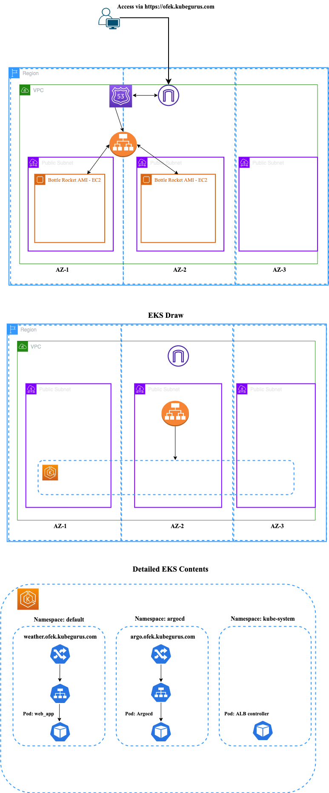

# Terraform EKS Cluster Project Dev-1

## Architecture Overview


## Description
This Terraform project orchestrates the creation of an Amazon Elastic Kubernetes Service (EKS) cluster, encompassing a Virtual Private Cloud (VPC) with public subnets distributed across multiple Availability Zones (AZs). In addition to provisioning the necessary infrastructure for EKS, Terraform is employed to establish policies and roles crucial for the Application Load Balancer (ALB) Ingress Controller and Elastic Block Store (EBS).

For enhanced functionality, it is advisable to integrate Route 53 and Certificate Manager to enable SSL traffic configuration for your ALB.

## EKS Cluster Contents
The EKS cluster within this project includes ArgoCD, ALB controller, and a weather application. ArgoCD, deployed via Helm, serves as the Continuous Delivery (CD) tool for the CI/CD pipeline (for reference my CI/CD pipeline is at https://github.com/OfekMalul/weather_app_project_eks/tree/main/.github/workflows). Argo than continously monitor my gitops repository https://github.com/OfekMalul/helm_charts to manage the deployment of the weather app.

## Pre Requirements
* Terraform installed
* AWS account
* Kubectl installed
## Installation

To install terraform on your machine please follow the link:
https://developer.hashicorp.com/terraform/tutorials/aws-get-started/install-cli

To install aws CLI on your machine:
https://docs.aws.amazon.com/cli/latest/userguide/getting-started-install.html

To install kubectl on your machine:
https://kubernetes.io/docs/tasks/tools/

To enable your local machine to communicate with your aws account you can:
1. Create a specific user group and user to manage the eks cluster
2. Utilize your admin account

```bash
aws configure
```

## Setup the EKS Cluster
In order to setup the cluster please follow along
1. Create VPC - Go to the vpc folder
```bash
terraform plan
terraform apply --auto-approve
```

2. Copy vpc_id to variables in the eks cluster (the vpc_id should appear on your terminal)

3. Create the EKS cluster - Go to EKS folder
```bash
terraform plan
terraform apply --auto-approve
```

4. Create the IAM policy - Go to IAM policy folder
```bash
terraform plan
terraform apply --auto-approve
```

5. Copy the policy arn (should appear on the console) into the roles variables file

6. Create the role - Go to Role folder
```bash
terraform plan
terraform apply --auto-approve
```

## Setup connection to EKS Cluster
In order to connect to your fresh new EKS cluster you need to configure your .kube/config file

```bash
aws eks update-kubeconfig --region us-east-1 --name terraform-eks-cluster
```

## Summary
At this stage, an EKS cluster is now provisioned with all necessary permissions in place. However, the creation of the load balancer for the EKS cluster is pending. To enable its functionality, you will need to deploy and configure the Helm chart associated with it. For reference, you can examine the Helm chart available in my repository.
https://github.com/OfekMalul/helm_charts